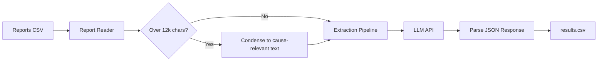

# Narrative Cause Extraction Pipeline

> Reads free-text investigation reports at scale and extracts confirmed cause, probable cause, and a confidence flag from each -- without manual review of every document.

## The Problem

Organizations analyzing large volumes of incident or investigation reports often need to identify which cases involve a specific cause type. Reading hundreds or thousands of free-text reports manually to extract and classify cause information is slow, inconsistent, and expensive. Reports vary in structure, use hedged language ("probable", "consistent with", "cannot be ruled out"), and embed the key finding across multiple sections.

## The Solution

This pipeline reads structured report text, sends each document to an LLM API, and extracts three fields: the confirmed cause (if stated), the probable cause (if no confirmed cause is present), and a confidence flag indicating whether the target cause was confirmed, probable, or not determinable. Results are written to a CSV for downstream analysis.

Designed for reports with defined section headings (Conclusion, Findings, Probable Cause) but adaptable to other structured narrative formats.

## Architecture



Reports longer than ~12,000 characters are automatically condensed to their cause-relevant content (Conclusion, Findings, Probable Cause sections) with a preliminary LLM call before extraction, rather than being sent in full. This keeps cost and consistency in check on long reports without truncating them.

## Stack

- Python 3.10+
- OpenAI API or Anthropic API (your choice, your key)
- python-dotenv

## How to Run

**1. Clone and install**
```bash
git clone https://github.com/emberlytic/narrative-cause-extraction.git
cd narrative-cause-extraction
pip install -r requirements.txt
```

**2. Configure your API key**
```bash
cp .env.example .env
# Edit .env -- set LLM_PROVIDER and add your API key
```

**3. Run against the included sample reports**
```bash
python src/main.py
```

Or point it at your own CSV:
```bash
python src/main.py path/to/your/reports.csv
```

**Sample output:**
```
Processing 18 reports...

[1/18] RPT-001... confirmed cause: Electrical fault at distribution panel
[2/18] RPT-002... probable cause: Unattended ignition source (not confirmed)
[3/18] RPT-003... cause not determinable
...

Results saved to: results.csv
```

Each row in `results.csv` also includes a `reasoning` field with a one-sentence explanation for the determination, e.g.:

```json
{
  "confirmed_cause": "Electrical fault at distribution panel",
  "probable_cause": "",
  "confidence": "confirmed",
  "reasoning": "The report's Conclusion section explicitly states the panel fault as the determined cause."
}
```

## Input Format

Your CSV must include these columns:

| Column | Description |
|---|---|
| `report_id` | Unique report identifier |
| `report_text` | Full report text (can include section headings) |

See `data/sample_reports.csv` for examples showing the expected structure.

## Output Format

The output CSV adds three columns to the input:

| Column | Description |
|---|---|
| `confirmed_cause` | Stated confirmed cause, or empty if none |
| `probable_cause` | Most likely cause when confirmed cause is absent |
| `confidence` | `confirmed`, `probable`, or `not_determinable` |
| `reasoning` | One sentence explaining the extraction |

## Adapting for Your Use Case

The prompt is tuned for investigation reports with cause-finding language. It works for:

- Insurance claim root cause analysis
- Product liability incident review
- Warranty claim defect classification
- Workplace incident root cause summaries
- Quality control failure reports

Adjust the prompt in `src/extraction_pipeline.py` to match the terminology and structure of your reports.

## Case Study

See [case-study.md](./case-study.md) for the full scenario walkthrough.

---

> Client names and identifying details in this case study are fictional.
> The problem structure, workflow logic, and solution approach are based on real-world patterns from actual engagements.
